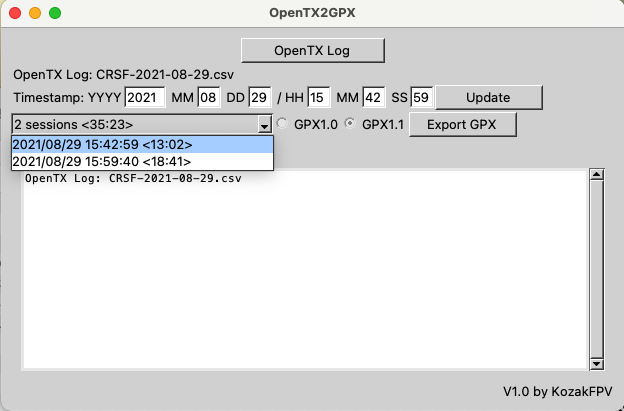

# OpenTX2GPX
OpenTX2GPX converts OpenTX Log file contains GPS telemetry data to GPX file. 

OpenTX2GPX reads timestamp, GPS coordinate, speed, altitude, number of GPS satelites from OpenTX log and exports to GPX track points.

## Setup
### Python environment
If you have Python 3.x environment, just you need to do following.
- pip install gpxpy
- python3 OpenTXGPX.py
### MacOS
Download and extract OpenTX2GPXMac.zip. OpenTX2GPX is MacOS executable.
### Windows
Download and extract OpenTX2GPXMac.zip. OpenTX2GPX.exe is Windows executable. 
Some of antivirus program may show trojan alert. I hope that you can setup antivirus software to ignore/bypass OpenTX2GPX.

## How to setup OpenTX to capture GPS data
Please refer Oscar Liang's web page.　 
https://oscarliang.com/log-gps-coordinates-taranis/

I recommend you to set correct date and time on OpenTX setup menu also.

## Usage

1. Click "OpenTX Log" button to select OpenTX log file. Sample log file is available at https://github.com/nkozawa/OpenTX2GPX/blob/main/samples/CRSF-2021-08-29.csv.
2. Timestamp fields will be filled up if OpenTX log file contains valid GPS data. Timestamp shows first valid GPS data entry.
3. If you need to change the timestamp, please modify timestamp fields and click "Update" button. Timestamp of all log entries will be updated accordingly.
4. OpenTX log usually contains multiple sessions (flights). Select pull down to a session to make GPX file.
5. Select GPX1.0 or GPX1.1 format.
6. Click "Export GPX" button to export GPX file.

## Applications
### Plot GPS cordinations on the map
* Google Earth
### Telemetry overlay on the footage
* Garmin VIRB Edit (only accepts GPX1.1). This is free software. This one is best telemetry edit tool, I think. However speed meter behavior is not good for me.
* Dashware (Windows only). This is free software. This one has more flexibility than Garmin VIRB Edit. Speed meter behavior is not good (just same to VIRB) at this moment. 
* RACE RENDER. This is not free software. It seems to me, speed meter behavior is good, but it is very slow, operation is not comfatable on my MacBook Pro.
#### Telemetry Overlay Sample Video

## Additional Informatios
- OpenTX is open source firmware for RC radio trasnmitter. It has ability to logging telemtry data from RC receiver on the drone or plane. If GPS device is available on the drone or plane, we will have GPS coordinate, speed and altitude. OpenTX log is stored on the SD card of RC radio as CSV format.
- GPX (GPS Exchange Format) is supported by various softwares and web sites. This is most convinent data format to carry GPS log entries.
